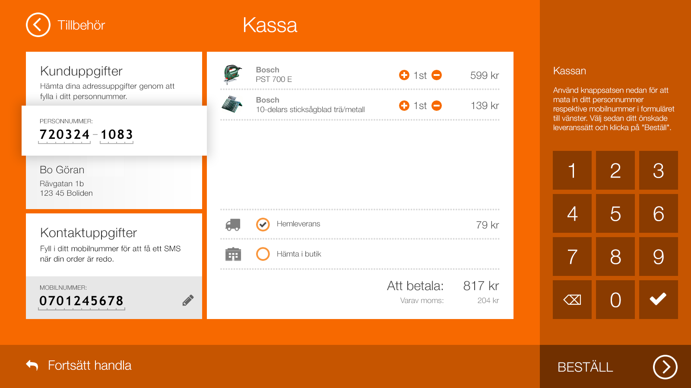

# kiosken-quiz
### HTML / CSS tech test
     
#### Design
This is written in HTML, CSS(Scss) and vanilla JS, and the page design is based on this image:     

      
#### Live Site
Kiosken-quiz: https://yaorangetime16.github.io/kiosk-test/
      
| Area | Tools |
|:----:|:-----:|
| Styles| SASS (SCSS)|
|Compile|Gulp.js|
|Version Control|Git & GitHub|
|Package Manager|npm|
|Icons| [Icon Finder](https://www.iconfinder.com)|
|Color|[Color-picker](https://imagecolorpicker.com/)|

**NOTE**     
* The website is not completely responsive (it works only for desktop (also iPad), but not for mobile phones)     
* The layout has been tested both on Windows OS and Mac OS, but it is more optimized for Mac